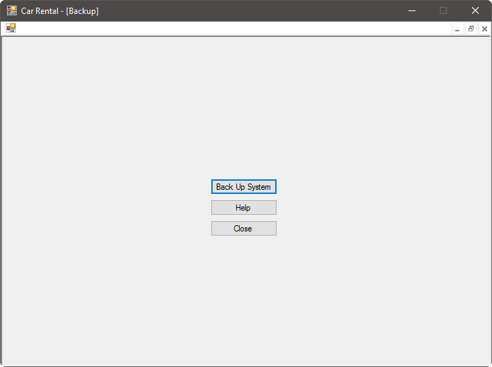

Backing up the database system is easy with our backup system. Once you have [logged on](gs.md) to the system, select Back Up System. This will present you with options to back up the system, see this help, or to return to the Home screen:



If you select the Back Up System option, the database contents will be saved to your desktop as a .sql file that can be directly imported into a MySQL database to recreate both the database structure and contents. The file is named as follows:

```
CarRentals yyyyMMdd HHmm.sql
```

where:

- yyyy is the current year (i.e., 2016)
- MM is the current month (i.e., 06)
- dd is the current day of month (i.e., 04)
- HH is the current hour of day in 24-hour time
- mm is the current minute of hour

When you select the option to back up, the system will respond that it has successfully backed up the database.
