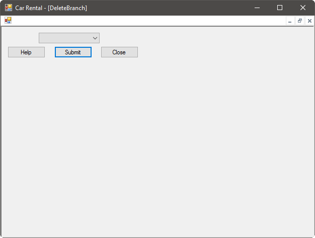

Our group spans many branches, and with our recent success, it is likely that we will be expanding rapidly. Also, sometimes branches move or close altogether. To accommodate this, employees can create, update, and delete branch locations as necessary.

To begin, ensure you have logged on to the system, then select the Branches option on the home screen. You will see a branch administration screen:

# Creating a Branch

To create a new branch, select Create a Branch from the branch administration screen. You will see a new window:

Here, you're prompted for the following branch information:

- Manager (selected from a list of users registered on the system)
- Address
- Postal code
- City
- State
- Country
- Email address
- Phone number
- Fax number (if available)

Once you have entered the information, simply press the Submit button and the branch will be created. The system will let you know if there were any issues with the information you entered, and once the branch has been created, the system will let you know that it was successful.

# Modifying a Branch

To modify a branch, select Modify a Branch from the branch administration screen. You will see a new window:

First, select the branch you want to modify from the drop-down list at the top of the window. You will see the current information presented from the system. At this point, you can change any or all of the email, phone number, fax number, email, or manager. **Note that if a branch is moving location, it should be deleted then a new branch created.** The address information of a branch cannot be changed for security reasons.

Once you are satisfied with the information for the branch, simply press Submit, and the branch will be updated. The system will let you know if there were any issues with the information you entered, and once the branch has been modified, the system will let you know that it was successful.

# Closing a Branch

To close a branch, select Close a Branch from the branch administration screen. You will see a new window:

First, select the branch you want to close from the drop-down list. After ensuring that you want to close this branch, press the Submit button. The system will close the branch and let you know that it was successful.
