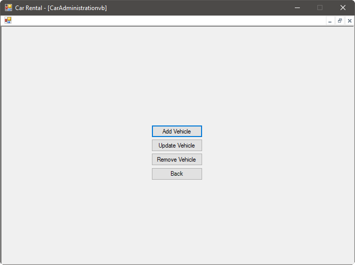
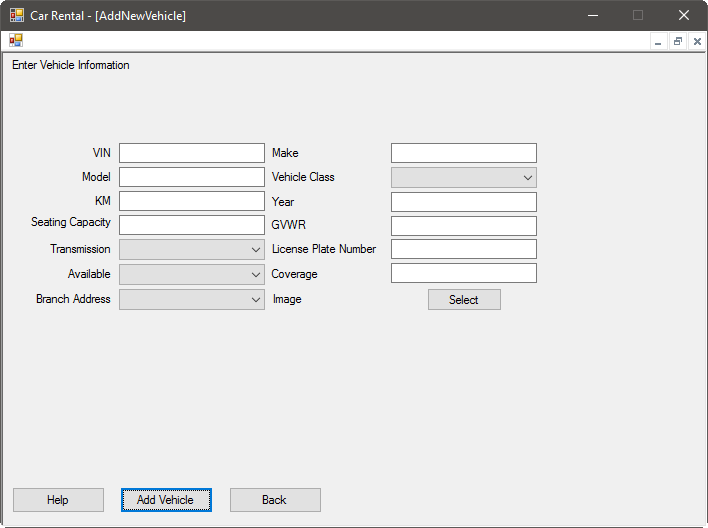
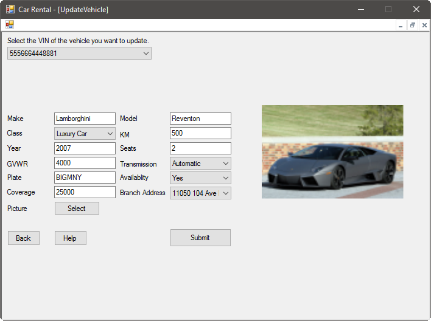
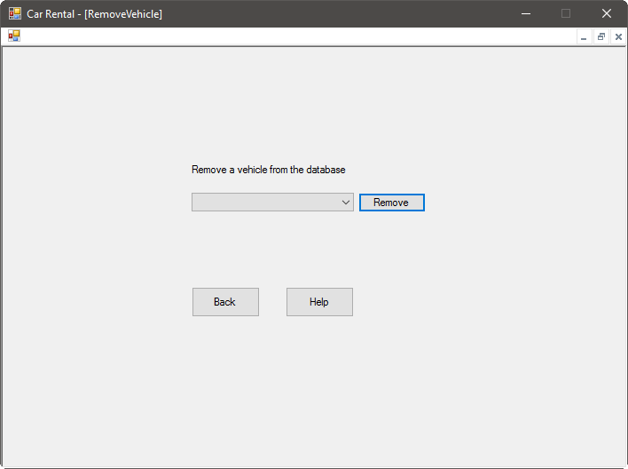

New cars are being added to our system regularly, and unfortunately, sometimes cars must be marked as unavailable. Thankfully, common operations such as adding or updating vehicles is easy with our system.

# Add a Vehicle

Because of our rapid expansion, you will likely want to add new vehicles to our system often. Our system makes this fun and easy. Select the Add Vehicle option, then enter the information asked for:

You will need to know the following information:

- The VIN
- The make
- The model
- The type of vehicle (see [types](types.md) for more information)
- The current mileage of the vehicle
- The model year of the vehicle
- How many people can sit it the vehicle legally
- The towing capacity, or GVWR, of the vehicle, in pounds
- The transmission type of the vehicle
- The licence plate of the vehicle
- Whether the vehicle is available for rental
- The coverage amount on the vehicle
- The branch that the vehicle will be at

Optionally, you can select an image for the vehicle. To do this, press the Select button and browse to the image of the vehicle. If you do not choose an image, a default will be used, but can be updated later. This image will be presented to the user when they are browsing our inventory. The images will be stored securely within our system.

Once you are finished entering information, press the Add Vehicle button.

# Update a Vehicle

Sometimes a vehicle will need to be updated. This will be commonly be done when a vehicle returns from being rented, and the kilometers will need to be updated. This can be done using the Update Vehicle screen:

First, select the VIN of the vehicle you wish to update from the drop-down menu at the top of the screen. You will see the current information for this vehicle updated in the boxes below. You can change any information as necessary, as well as updating the picture stored for the vehicle. If you select a new image for the vehicle, you will see a preview to the right of the information.

Once you are finished updating the vehicle's information, press the Submit button.

# Remove a Vehicle

Unfortunately, sometimes vehicles must be removed from our system. This can be done using the Remove Vehicle screen:

Simply select the VIN of the vehicle you want to remove, then press the Remove button.
