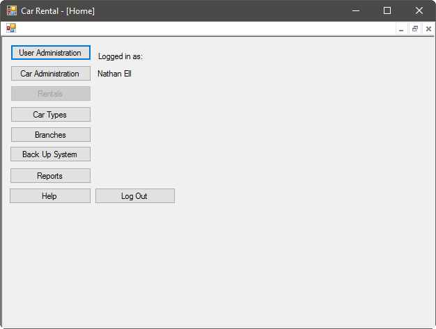

# Getting Started
## Registered Employee
If you're already a registered employee, enter your username and password when prompted, and press Submit:

## Guest
If you're not a registered guest, feel free to view our inventory using the View Inventory button:

# The Employee Home Screen
## The Home Screen
## User Administration
Our car rental system allows employees to perform user administration easily and quickly. The operations supported include user creation, deletion, and modification. To begin user administration, [log in](#registered-employee) to open the [employee home screen](#the-home-screen). From the employee home screen, select User Administration:

The following screen will appear:

