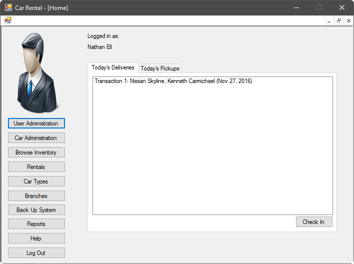

The home screen is your portal to the system's functionality. Here, you can do common operations such as performing user administration. Simply select the operation you would like to perform; or, you can select Logout to quit your session.

# Processing a Delivery

When a customer is ready to return a vehicle they rented, you can accept the keys and verify their transaction number, name, and vehicle type. On the right portion of the Home screen, in the tab named Today's Deliveries, select the item that corresponds to the vehicle that is being returned. Then, press the Check In button at the bottom right of the screen. The transaction will be marked as complete in the system, then removed from your list of vehicles that are due.

## Late Fees

If the customer returned the vehicle late, you will be notified that a charge will be applied to the customer's credit card. **The standard late fee is $20 per day.**

# Processing a Pickup

When a customer is ready to pick up a vehicle they have ordered, first verify their transaction number, name, and the vehicle she ordered. Then, on the right portion of the Home screen, in the tab named Today's Pickups, select the item that corresponds to the vehicle that is being rented:

Once you have selected the vehicle to rent out, press the Check Out button. The vehicle will be marked as picked up in the system. Please note that the late fee is $20 per day past the rental return date.
