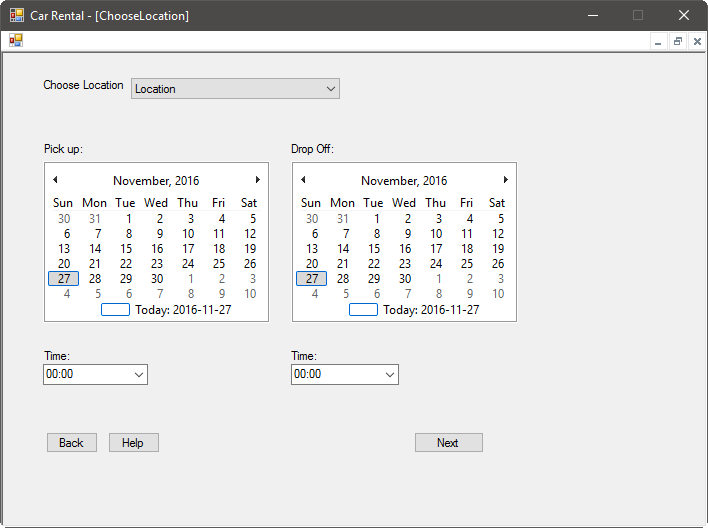
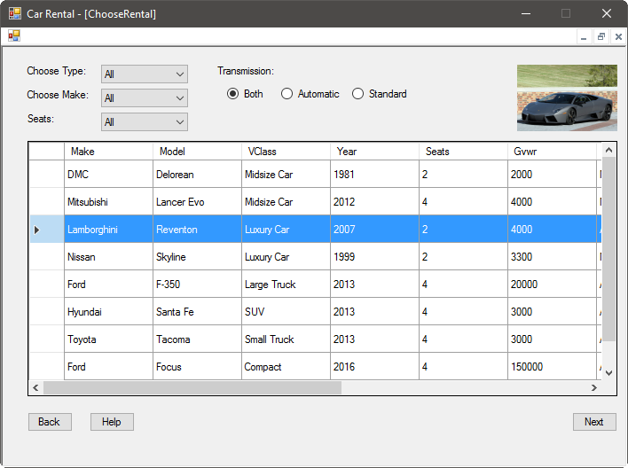
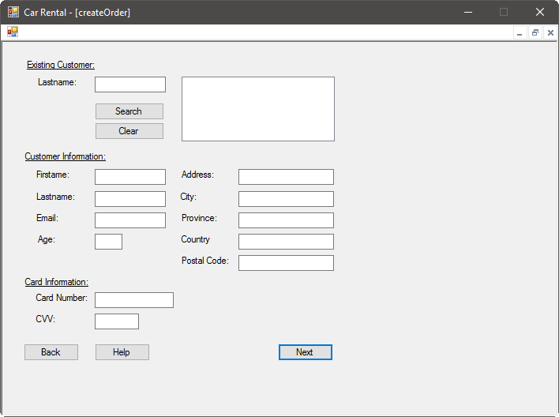
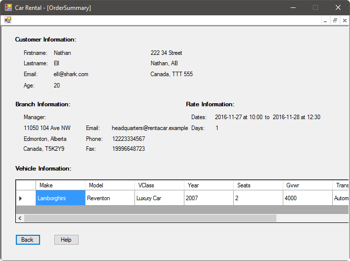

Of course, the major use for our system will be to create rentals for customers.

# Pickup Information

First, we need to know some information about where the rental will be picked up:

Here, you can select the branch that the customer will pick their vehicle up from, as well as how long they will rent the vehicle for. Select the date and time that the customer will pick the vehicle up at, then select the date and time that the customer will return their vehicle. Once you are finished entering this information, press the Next button.

# Vehicle Selection

There are many options that you can choose from. You can:

- Select the type of vehicle you're interested in, such as mini-van or SUV
- Select the make of the vehicle you're interested in, such as Ford or Dodge
- Select the number of seats you need in a vehicle
- The ideal transmission of the vehicle, if you prefer automatic or standard

You can make any choices that you wish, or none at all. Once you have made your
choices, you can see the various vehicles we offer that meet your requirements.
If you click on any vehicle that interests you, you will be presented with a
picture of the vehicle in the top right of the application.

Once you have selected the desired vehicle, press the Next button.

# Customer Information

Next, we need some information from the customer:

You can either enter the information of the customer if they are new to our rental system, or search by their last name if they are an existing customer. If you select an existing customer, their information will populate the boxes, and should be verified. Then, enter the customer's credit card information, and press Next.

# Order Summary

Finally, the order information will be summarized before charging the customer's credit card:

If all the information appears to be correct, press the Finish button.
