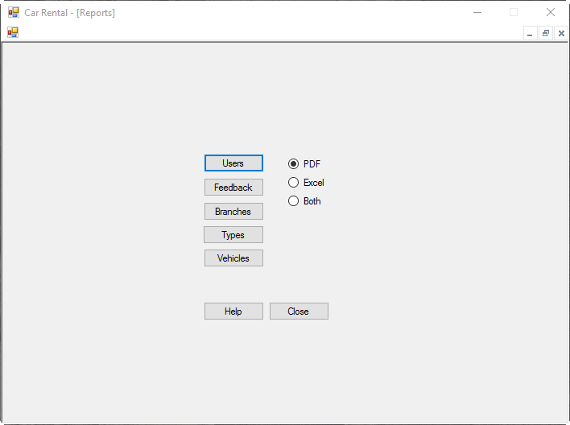

Several reports can be generated using our system, like seeing all the users registered on the system.

To generate a report, first ensure that you are [logged in](gs.md). From the home screen, select the Reports option. This will present a screen with a variety of reports that can be generated:

Simply select an output format that you want (PDF, Excel, or both) then select which report you want to generate. The report(s) will be saved on your desktop, with the type of report and timestamp in the filename, and either .pdf or .csv extension. If you selected only PDF or Excel as the output format, the system will also open the report to be viewed. If you selected both formats, however, the report will not be opened, but can be opened from the file on the desktop.
