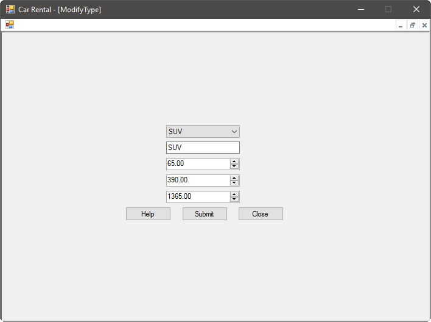

Vehicles come in many different types, and each type needs to have a different daily, weekly, and monthly rates. To accommodate this, logged-in employees can  create new vehicle types or update existing vehicle types. To begin using the vehicle type system, make sure you're [logged in](gs.md) select Car Types from the employee home screen. You will be presented with the following screen:

# Creating a Vehicle Type

To create a new vehicle type, select Create a Type from the Car Types screen. You will see the following window:

Here, you will need to enter:

- A short description of the type, such as Small Car or SUV
- A daily rate
- A weekly rate
- A monthly rate

Once the information is entered, press submit. If there are any issues with the information you entered, the system will let you know; otherwise, the system will create the type and let you know that it was successful.

# Updating a Vehicle Type

To update a vehicle type, select Modify a Type from the Car Types screen. You will see the following window:

First, you must select the vehicle type that you want to change from the drop-down list at the top of the screen. You can then change the description of the type, and any of the rates associated with it. Once you are satisfied with your changes, press the Submit button. The system will validate the information you entered, and will let you know if there were any errors. It will then update the vehicle type stored in the system, and let you know when the operation is completed.
