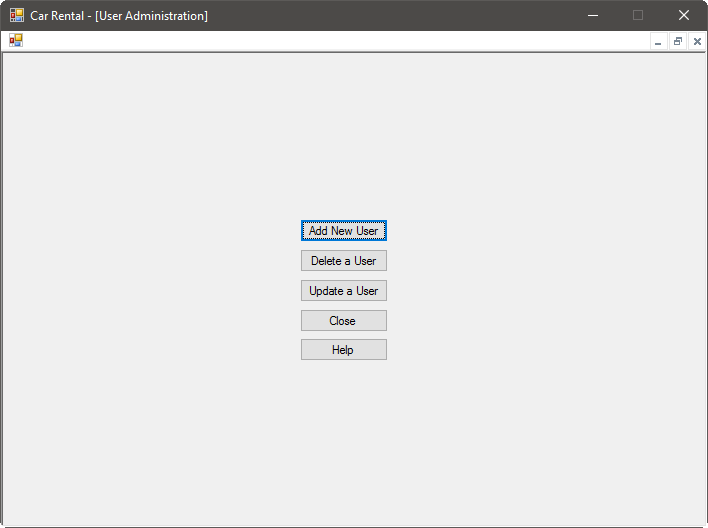
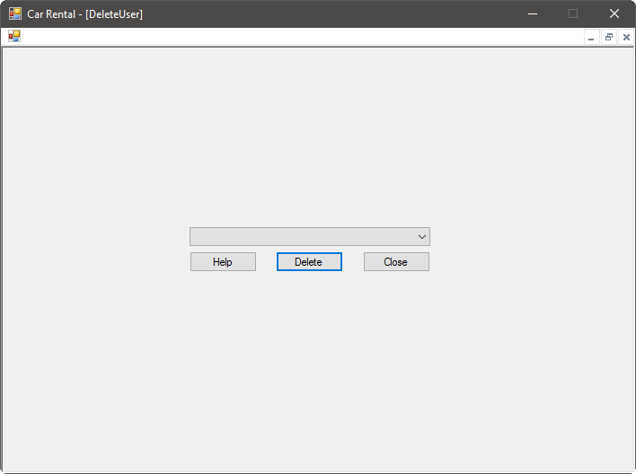

Our car rental system allows employees to perform user administration easily and quickly. The operations supported include user creation, deletion, and modification. To begin user administration, [log in](gs.md) to open the employee home screen. From the home screen, select User Administration. The following screen will appear:

# Adding a User
To add a user to the system, first open the user administration screen, and select the Add New User option. This will open the new user screen:

You will need to know the following information:

- A unique username
- Strong, private password
- First name
- Last name
- Full Address
- Email
- Branch the user works at

Optionally, you can provide a picture, as well. Press the Select Image button, and browse to where the picture for the user is stored. This picture will be stored securely within our network. If you do not select an image, a default image will be used. When you select an image, a preview will be displayed to the right of the information.

Enter the information, then click on Submit. The system will notify you that the user has been registered. If the system requires you to change the information you entered, you will be informed when you click on Submit.

# Deleting a User
To delete a user from the system, first open the user administration screen, and select the Delete a User option. This will open the user deletion screen:

When you have made your selection and are ready to delete the user, press the Delete button. Once you are done deleting users, press the Done button. The system will notify you that the deletion has been completed.

# Updating a User
To update a user in the system, first open the user administration screen, and select the Update a User option. This will open the user modification screen:

Select the username of the user you wish to update from the drop-down box at the top of the screen. This will update the screen with the current information of the user. **Please refer to the section on passwords below for more information on the password modification box.** The username of the user cannot be changed. If you choose to update the user's picture, the new picture will be previewed to the right of the information. Once you are satisfied with the information you have modified, press the Submit button. The system will notify you that the update has been completed.

## Passwords
When you select a user from the drop-down menu, you will notice that the user's password is not shown. This is to protect the privacy of users in the system. **By default, if you do not enter a password, the password will not be changed. If you enter a password, the user's password will be changed. Do not enter text into the password box unless you want to change the user's password.**
