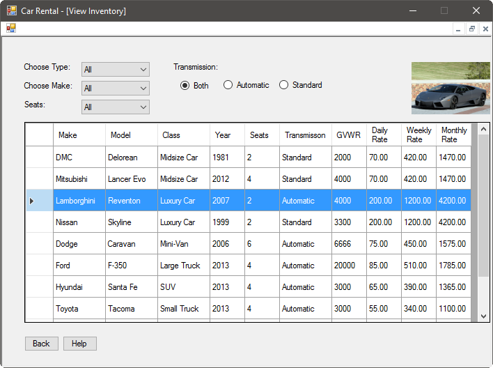

Our inventory is just a few clicks away when you want to view it. It's easy to
use, also. The following is the screen that you will see, which presents some
options to help make your viewing easier:

There are many options that you can choose from. You can:

- Select the type of vehicle you're interested in, such as mini-van or SUV
- Select the make of the vehicle you're interested in, such as Ford or Dodge
- Select the number of seats you need in a vehicle
- The ideal transmission of the vehicle, if you prefer automatic or standard

You can make any choices that you wish, or none at all. Once you have made your
choices, you can see the various vehicles we offer that meet your requirements.
If you click on any vehicle that interests you, you will be presented with a
picture of the vehicle in the top right of the application.
