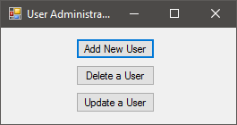

# Table of Contents
<!-- TOC depthFrom:1 depthTo:6 withLinks:1 updateOnSave:1 orderedList:0 -->

- [Table of Contents](#table-of-contents)
- [Introduction](#introduction)
- [Getting Started](#getting-started)
	- [Registered Employee](#registered-employee)
	- [Guest](#guest)
- [The Employee Home Screen](#the-employee-home-screen)
	- [The Home Screen](#the-home-screen)
	- [User Administration](#user-administration)
		- [Adding a User](#adding-a-user)
		- [Deleting a User](#deleting-a-user)
		- [Updating a User](#updating-a-user)
			- [Passwords](#passwords)

<!-- /TOC -->

# Introduction
Thank you for using our car rental system. We hope that your experience is pleasurable and useful. However, we understand that sometimes, you need a hand. This guide will help you to use the system to it's full potential.

# Getting Started
## Registered Employee
If you're already a registered employee, enter your username and password when prompted, and press Submit:

## Guest
If you're not a registered guest, feel free to view our inventory using the View Inventory button:

# The Employee Home Screen
## The Home Screen
## User Administration
Our car rental system allows employees to perform user administration easily and quickly. The operations supported include user creation, deletion, and modification. To begin user administration, [log in](#registered-employee) to open the [employee home screen](#the-home-screen). From the employee home screen, select User Administration:

The following screen will appear:

### Adding a User
To add a user to the system, first [open the user administration](#User-Administration) screen, and select the Add New User option. This will open the new user screen:

You will need to know the following information:
- A unique username
- Strong, private password
- First name
- Last name
- Full Address
- Email

Enter the information, then click on Submit. The system will notify you that the user has been registered. If the system requires you to change the information you entered, you will be informed when you click on Submit.

### Deleting a User
To delete a user from the system, first [open the user administration](#User-Administration) screen, and select the Delete a User option. This will open the user deletion screen:

When you have made your selection and are ready to delete the user, press the Delete button. Once you are done deleting users, press the Done button. The system will notify you that the deletion has been completed.

### Updating a User
To update a user in the system, first [open the user administration](#User-Administration) screen, and select the Update a User option. This will open the user modification screen:

Select the username of the user you wish to update from the drop-down box at the top of the screen. This will update the screen with the current information of the user. *Please refer to the section on [passwords](#Passwords) for more information on the password modification box.* The username of the user cannot be changed. Once you are satisfied with the information you have modified, press the Submit button. The system will notify you that the update has been completed.

#### Passwords
When you select a user from the drop-down menu, you will notice that the user's password is not shown. This is to protect the privacy of users in the system. **By default, if you do not enter a password, the password will not be changed. If you enter a password, the user's password will be changed. Do not enter text into the password box unless you want to change the user's password.**
